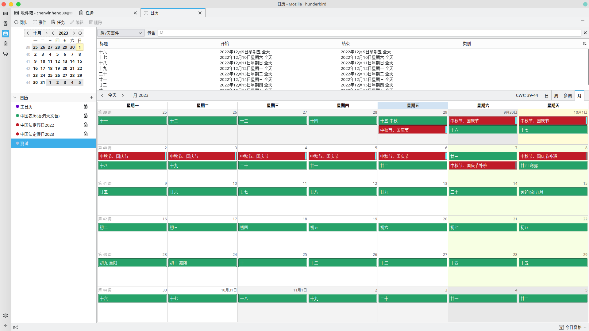
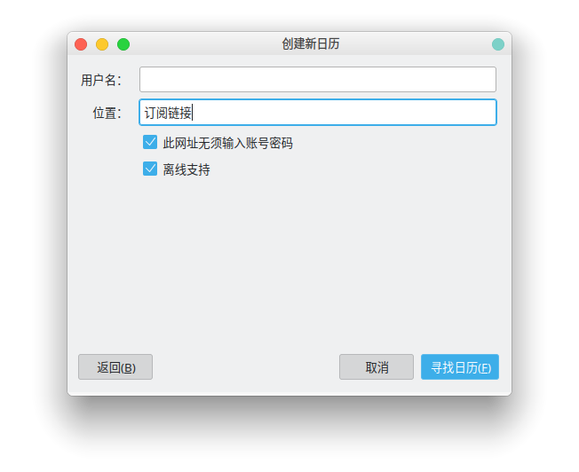

---
# Feel free to add content and custom Front Matter to this file.
# To modify the layout, see https://jekyllrb.com/docs/themes/#overriding-theme-defaults

layout: home
---
# iCalendar格式的国家法定节日与补班的日历

iCalendar是一种通用的日历交换格式，很多软件和设备，比如google calendar, apple calendar, iphone/ipad, 安卓以及开源的thunderbird都支持。

参考每年的12月份左右发布下一年的法定假日：元旦、春节、清明节、劳动节、端午节、中秋节与国庆节的假期与调休安排。

## 用法:

使用[Thunderbird订阅日历](https://support.mozilla.org/zh-CN/kb/%E6%B7%BB%E5%8A%A0%E5%81%87%E6%9C%9F%E6%97%A5%E5%8E%86)

下载与订阅日历的[链接](_data/chinese-public-holidays/latest.ics)